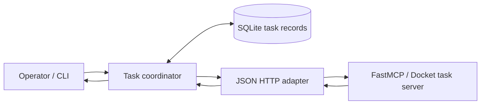

# Durable MCP Client

[](https://github.com/ruoyu-lu/durable-mcp-client/actions/workflows/compatibility.yml)


A client-side approach to managing long-running MCP tasks across disconnects and restarts.

The standalone CLI stores task handles and results in SQLite, resumes observation after client exit, and supports explicit input responses, cancellation and bounded waits.

## Why I built this

Long-running agent tasks often outlive a CLI process or network connection. I built this client to make recovery an explicit, inspectable workflow: save the task handle and user intent locally, reconnect later, and never guess whether an uncertain submission should be repeated. It is a client-side durability layer, not a claim that server-side work is automatically checkpointed.

## Implemented capabilities

- Persistent task records scoped to an adapter and endpoint.
- Submission uncertainty and observation failures kept separate from remote status.
- Durable cancellation/input attempts with duplicate-response guards.
- Wait deadlines, server polling hints and local signal interruption.
- FastMCP examples covering batch hashing, cancellation and background form input.

## Architecture



The CLI persists handles and intent before network calls. On restart, `recover` reads SQLite and observes known remote tasks without blindly resubmitting uncertain work.

The current example uses an in-memory server backend. Redis server-restart evidence and an installable CLI alpha are the [next release gates](docs/roadmap.md). Authentication, caller/session identity, host adapters and result outbox are not implemented.

Server scheduling and execution are delegated to existing runtimes. Here, **durable** refers to client-side task tracking and recovery; it does not promise automatic checkpointing of arbitrary server code or exactly-once external side effects.

## Documentation

| Document | Contents |
| --- | --- |
| [Product scope](docs/product.md) | Use cases, boundaries, and acceptance criteria |
| [Architecture](docs/architecture.md) | Components, records, recovery, and delivery semantics |
| [Roadmap](docs/roadmap.md) | Milestones and decision gates |
| [Validation](docs/validation.md) | Protocol checks and fault-injection scenarios |
| [Compatibility baseline](docs/compatibility.md) | Pinned Tasks contract and outstanding implementation checks |
| [Research](docs/research.md) | Upstream references and assumptions to verify |
| [Current decision](docs/decisions/0002-cli-alpha-and-release-gates.md) | CLI alpha and release gates |
| [Project review](docs/audits/2026-09-21.md) | Verified progress, gaps and priorities |
| [Backlog](docs/backlog.md) | Development tasks and progress |

## Run the CLI

Requires Node 22.13 or newer. This version uses Node's built-in SQLite, which may emit an experimental-feature warning.

```sh
npm ci --ignore-scripts
npm run build
node dist/cli.js submit --text "hello after restart" --delay-ms 1000
# Exit the shell/process if desired. Reuse the same database path.
node dist/cli.js list
node dist/cli.js recover
node dist/cli.js status <task-id>
```

Commands return JSON. `--db PATH` selects the SQLite file (default `.runtime/tasks.sqlite`, relative to the current directory). Use the same absolute path when running from different directories. `status` refreshes one task; `recover` refreshes unfinished tasks once and exits. Unknown submissions are retained without automatic resubmission. Query errors are recorded separately from remote task status. Invalid adapter snapshots preserve the last valid state and are reported as observation errors. Once a terminal snapshot is saved, later observations and query errors cannot modify the record.

The included `demo-v1` adapter is a deterministic mock: its handle encodes a readiness time and result. It demonstrates client persistence across processes, not server scheduling or live MCP interoperability. The adapter interface allows replacing it without changing the SQLite coordinator. The demo adapter does not support cancellation. Host delivery is not implemented yet. Use wait for bounded polling. The database stores task input/results in plaintext; use non-sensitive demo data.

## MCP HTTP endpoint

```sh
node dist/cli.js submit --server http://localhost:8000/mcp --tool batch --arguments '{"count":2}'
node dist/cli.js recover --server http://localhost:8000/mcp
node dist/cli.js status <task-id> --server http://localhost:8000/mcp
```

Reuse the same endpoint and database after restart. The adapter binds records to the endpoint, discovers support for protocol `2026-07-28` and the Tasks extension, then calls `tools/call` and `tasks/get`. Accepted handles are saved before reading task state; the initial snapshot is null until queried. Direct tool results are stored as completed records with a local handle.

This small HTTP shim bypasses the pinned SDK's unsupported Tasks methods. Loopback integration tests verify real HTTP and separate CLI processes; FastMCP 4.0.3 interoperability is covered by the [background hashing example](examples/fastmcp/README.md) and an optional real-server integration test. Only JSON responses are supported, with a 30-second request timeout and no automatic submission retry. SSE, authentication, legacy negotiation are not supported. Endpoint URLs cannot contain credentials, query parameters or fragments. A failed observation preserves the handle for the next query.

## Wait for a task

```sh
node dist/cli.js wait <task-id> --server http://localhost:8000/mcp --interval-ms 1000 --timeout-ms 60000
```

`wait` returns `{ "reason": "...", "task": { ... } }`. Reasons are `terminal`, `input_required`, `unknown_submission`, or `timeout`; a signal interruption returns `interrupted`. A timeout exits with code 2; SIGINT (Ctrl+C) exits with code 130 and SIGTERM with 143; other outcomes exit with code 0, so inspect the task status to distinguish completion from failure or cancellation. Both options accept integer milliseconds from 1 to 86400000. Omit `--server` for demo tasks.

The command polls only the saved handle, retrying observation errors until the deadline. After each query, the next delay is the larger of `--interval-ms` and the latest valid server `pollIntervalMs`. Query hints are persisted with the snapshot, may change on later observations, and never extend the overall timeout. Invalid advisory values are ignored. The first query remains immediate; task-creation hints are not retained yet. It never resubmits work, cancels a task, or answers input. Each observation is persisted. HTTP requests and sleeps are interrupted at the deadline; custom adapters must honor the optional query AbortSignal. Remote work continues after the client times out or is interrupted. During `wait`, SIGINT/SIGTERM aborts local HTTP observation or polling sleep, prints the saved task, removes signal handlers and closes SQLite. An aborted observation preserves the last valid record rather than recording a new remote failure. Cached terminal records and unknown submissions return immediately. Waiting tasks are refreshed so stale input requests do not prevent progress after a response.

## Inspect pending input

When a task reports `input_required`, `status` and `recover` retain its request map in `snapshot.inputRequests`. Each entry preserves the server's method and parameters under its request key. `list` reads the saved requests without connecting to the server, including after a client restart. Malformed request envelopes become observation errors without replacing the last valid snapshot. A later working or terminal snapshot clears the outstanding requests.

These requests are displayed as data only. The client does not execute server-requested actions or submit answers automatically. Use `respond` to send a response object for one displayed request key:

```sh
node dist/cli.js respond <task-id> --server http://localhost:8000/mcp --request-key choice --response '{"action":"accept","content":{"label":"chosen"}}'
node dist/cli.js status <task-id> --server http://localhost:8000/mcp
```

Inspect the request and supply the response explicitly. Before sending, `respond` refreshes the task and validates the outstanding key inside the reservation transaction. Form elicitation checks the action, flat content and supplied JSON Schema (draft 2020-12 by default, or explicitly declared draft-07), including formats. Unsupported schemas fail locally; no remote schema fetching, coercion or defaults are applied. Invalid forms leave the key unreserved, so correct the response and run `respond` again. Other input methods receive plain-JSON checks only.

Each sent response has an `attemptId` and a persisted `pending`, `acknowledged`, `unknown` or `rejected` outcome, separate from task status. A trusted adapter may report `rejected` only with evidence that the server did not accept the response. An explicit correction then refreshes the outstanding key and reserves a new attempt, retaining the rejection history. Concurrent corrections cannot reuse the same rejected attempt.

The current HTTP adapter treats all remote failures as `unknown`, including JSON-RPC `-32602`. Error codes and a still-outstanding key do not prove non-acceptance. Pending, unknown and acknowledged attempts remain blocked across restarts, including older records without attempt IDs. Poll to learn the task's state; polling does not unlock retries. There is no automatic replay or force override. Structured failure details preserve HTTP status or protocol code/data where available. Inspect the returned record: a delivery failure can return JSON with exit code 0. Acknowledgment does not prove the task has resumed. Responses and error data are stored in plaintext.

The response flow is covered by loopback HTTP/process-restart tests, controlled-adapter rejection/race tests and the real FastMCP `choose_label` example with an invalid-then-corrected form. Form elicitation through background task input is verified; standalone server-initiated requests and other input methods remain outside this coverage.

## Cancel a remote task

```sh
node dist/cli.js cancel <task-id> --server http://localhost:8000/mcp
node dist/cli.js status <task-id> --server http://localhost:8000/mcp
```

Cancellation intent is persisted before sending `tasks/cancel`. The returned record's `cancellation.outcome` is `acknowledged` when the server acknowledges the request, or `unknown` if it fails or the response cannot be validated. A crash can leave `pending`; that does not prove whether the request reached the server. These values are separate from the task's observed status: only a query can confirm `cancelled`, and work may complete before cancellation takes effect.

`status` and `recover` keep querying without automatically resending cancellation. Repeat `cancel` explicitly if desired. A terminal task is returned unchanged; unknown submissions and unsupported adapters are rejected. Existing database records need no migration. Cancellation errors appear in `cancellation.error`; as with query failures, inspect the JSON record rather than relying only on the exit code.

## Tests and CI

`npm run check` validates the TypeScript build and static checks; `npm test` covers persistence, separate-process recovery, uncertain submissions, observation errors, terminal-state preservation, cancellation and input responses. The [Build and test workflow](https://github.com/ruoyu-lu/durable-mcp-client/actions/workflows/compatibility.yml) runs the checks on Node 22.13 and 24 and exercises FastMCP interoperability. The badge above reflects that workflow's live status.

## Development

```sh
npm run check
npm test
```

Tests compile the TypeScript runtime and cover separate-process CLI recovery, persistent handles, unknown submissions, observation failures and terminal-state preservation. Additional SDK probes characterize known compatibility gaps. See [CONTRIBUTING.md](CONTRIBUTING.md) and the [compatibility baseline](docs/compatibility.md).

## License

[MIT](LICENSE) © 2026 Ruoyu Lu.
